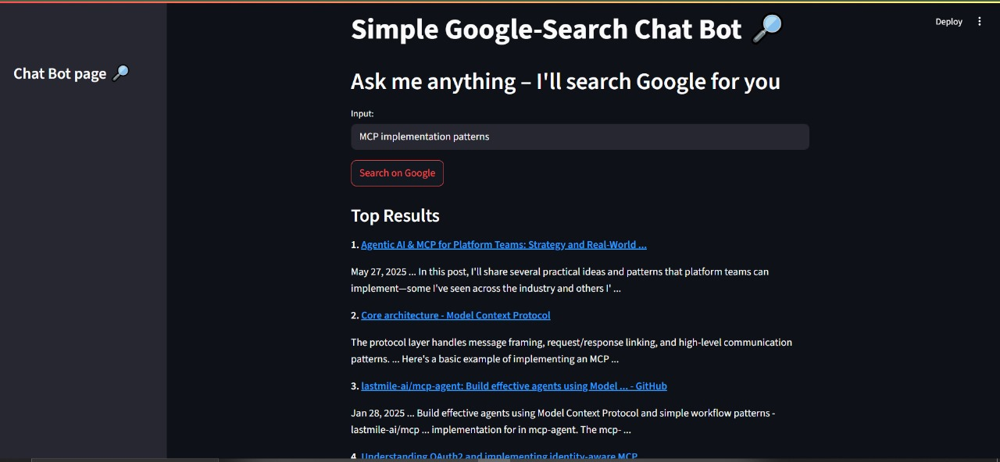
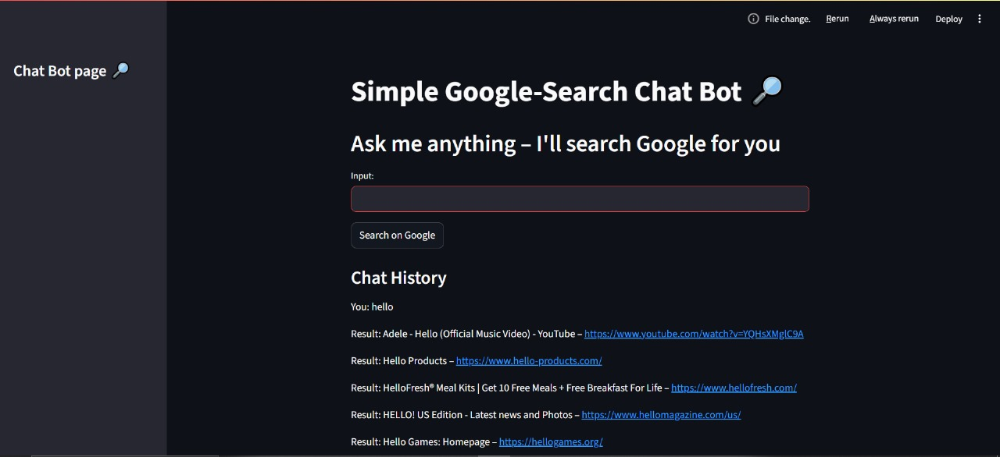
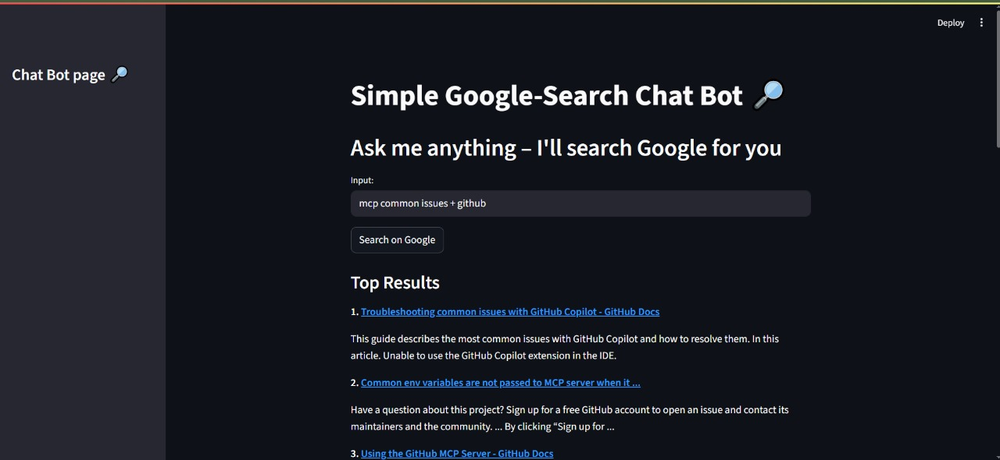

# Google-Search Chatbot (Streamlit)

A minimal chatbot-style web app built with **Streamlit** that answers a user's query by returning Google search results via the **Google Programmable Search API**.

<div align="center">





</div>

---

## Features
* Chat-like interface (keeps a running history)
* Top Google results shown with title, link, and snippet
* Fully client-side Streamlit UI – no backend server required beyond Streamlit itself

---

## Prerequisites
1. **Python 3.10 +** (tested with 3.12)
2. A free **Google Programmable Search** (CSE) API key and Search-Engine ID (CX).
   * Create or manage your search engine at <https://programmablesearchengine.google.com>.
   * Get an API key from <https://console.cloud.google.com/apis/credentials>.

---

## Setup (Windows PowerShell examples)

```powershell
# 1) Clone or download this repository, then cd into the project folder
cd QA-chatbot-mcp-servers

# 2) Create & activate a virtual-environment (skip if you already have .venv)
python -m venv .venv
.\.venv\Scripts\Activate.ps1

# 3) Install dependencies
pip install -r requirements.txt

# 4) Create a .env file with your credentials
New-Item .env -Value "GOOGLE_API_KEY=your_api_key_here`nGOOGLE_CLIENT_ID=your_cx_here"
```
_
Replace the values with your real key and CX string._

---

## Running the app

```powershell
# Make sure your venv is activated
streamlit run chatBot.py
```
Streamlit will print something like:

```
  Local URL: http://localhost:8501
```
Open that URL in your browser and chat away!

Add `--server.headless true` if you're running on a remote machine without a GUI.

---

## Project structure
```
QA-chatbot-mcp-servers/
├─ .venv/               # virtual-environment (ignored by git)
├─ chatBot.py           # Streamlit application
├─ requirements.txt     # Python dependencies
├─ README.md            # you're here
└─ .env                 # your secrets (NOT committed)
```

---

## Customising
* Change the number of search results in `chatBot.py` (`num_results=5`).
* Tweak the markdown formatting or styling in the same file.

---

## License
This project is provided "as-is" for educational purposes. Use at your own risk and mind Google's API quotas & terms.
