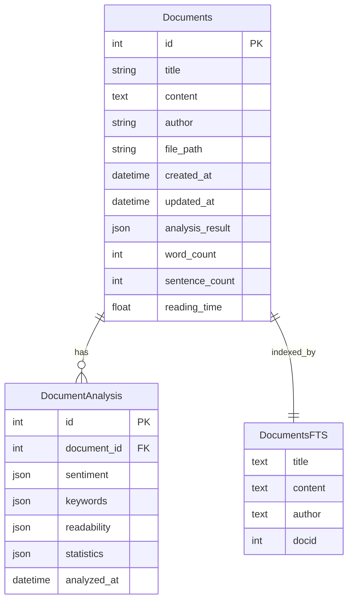
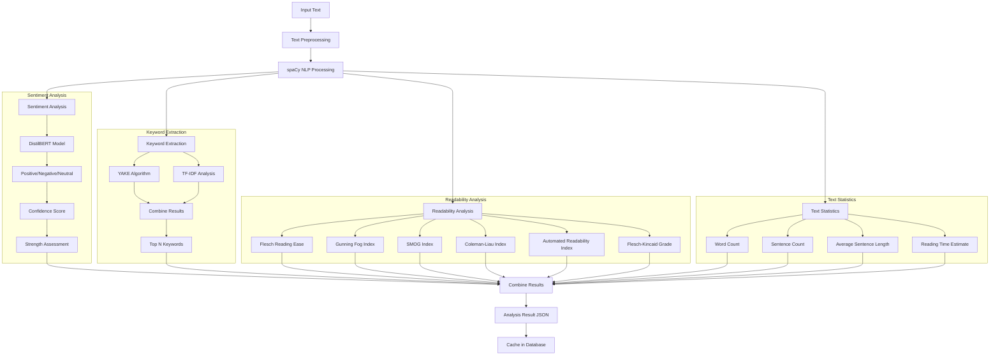
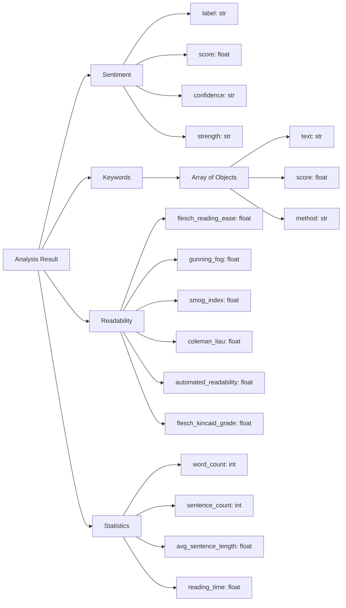

# Database Schema & NLP Pipeline

## Database Schema

```mermaid
erDiagram
    Documents ||--o{ DocumentAnalysis : has
    Documents {
        int id PK
        string title
        text content
        string author
        string file_path
        datetime created_at
        datetime updated_at
        json analysis_result
        int word_count
        int sentence_count
        float reading_time
    }
    
    DocumentAnalysis {
        int id PK
        int document_id FK
        json sentiment
        json keywords
        json readability
        json statistics
        datetime analyzed_at
    }
    
    DocumentsFTS {
        text title
        text content
        text author
        int docid
    }
    
    Documents ||--|| DocumentsFTS : indexed_by
```

## NLP Analysis Pipeline

```mermaid
flowchart TD
    A[Input Text] --> B[Text Preprocessing]
    B --> C[spaCy NLP Processing]
    
    C --> D[Sentiment Analysis]
    C --> E[Keyword Extraction]
    C --> F[Readability Analysis]
    C --> G[Text Statistics]
    
    subgraph "Sentiment Analysis"
        D --> D1[DistilBERT Model]
        D1 --> D2[Positive/Negative/Neutral]
        D2 --> D3[Confidence Score]
        D3 --> D4[Strength Assessment]
    end
    
    subgraph "Keyword Extraction"
        E --> E1[YAKE Algorithm]
        E --> E2[TF-IDF Analysis]
        E1 --> E3[Combine Results]
        E2 --> E3
        E3 --> E4[Top N Keywords]
    end
    
    subgraph "Readability Analysis"
        F --> F1[Flesch Reading Ease]
        F --> F2[Gunning Fog Index]
        F --> F3[SMOG Index]
        F --> F4[Coleman-Liau Index]
        F --> F5[Automated Readability Index]
        F --> F6[Flesch-Kincaid Grade]
    end
    
    subgraph "Text Statistics"
        G --> G1[Word Count]
        G --> G2[Sentence Count]
        G --> G3[Average Sentence Length]
        G --> G4[Reading Time Estimate]
    end
    
    D4 --> H[Combine Results]
    E4 --> H
    F1 --> H
    F2 --> H
    F3 --> H
    F4 --> H
    F5 --> H
    F6 --> H
    G1 --> H
    G2 --> H
    G3 --> H
    G4 --> H
    
    H --> I[Analysis Result JSON]
    I --> J[Cache in Database]
```

## Analysis Result Schema

```mermaid
graph LR
    A[Analysis Result] --> B[Sentiment]
    A --> C[Keywords]
    A --> D[Readability]
    A --> E[Statistics]
    
    B --> B1[label: str]
    B --> B2[score: float]
    B --> B3[confidence: str]
    B --> B4[strength: str]
    
    C --> C1[Array of Objects]
    C1 --> C2[text: str]
    C1 --> C3[score: float]
    C1 --> C4[method: str]
    
    D --> D1[flesch_reading_ease: float]
    D --> D2[gunning_fog: float]
    D --> D3[smog_index: float]
    D --> D4[coleman_liau: float]
    D --> D5[automated_readability: float]
    D --> D6[flesch_kincaid_grade: float]
    
    E --> E1[word_count: int]
    E --> E2[sentence_count: int]
    E --> E3[avg_sentence_length: float]
    E --> E4[reading_time: float]
``` 