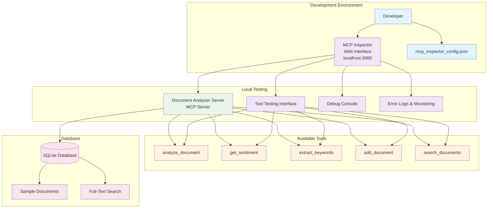

# MCP Inspector Architecture

## Development & Testing Workflow

The MCP Inspector provides a local testing environment for MCP servers without requiring external MCP clients.

## Architecture with Inspector

## Testing Workflow

1. **Start Inspector**: Run `run_inspector.ps1` or `run_inspector.bat`
2. **Access Web Interface**: Open `http://localhost:3000`
3. **Test Tools**: Use the web interface to test all 5 MCP tools
4. **Debug Issues**: View errors and performance metrics
5. **Iterate**: Fix issues and retest without external dependencies

## Production vs Development

### Development (with Inspector)
- Local testing environment
- Immediate feedback on tool functionality
- Error debugging and performance monitoring
- No external dependencies required

### Production (with Claude/Cursor)
- Real MCP client integration
- User-facing functionality
- Hosted server deployment
- External MCP host connections

## Inspector Features

### Tool Testing
- **Interactive Forms**: Test tools with custom parameters
- **Sample Data**: Pre-loaded test cases and examples
- **Result Validation**: Verify tool outputs and formats
- **Parameter Validation**: Test input validation and error handling

### Debugging
- **Error Messages**: Detailed error information and stack traces
- **Performance Metrics**: Tool execution times and resource usage
- **Connection Status**: MCP server connectivity monitoring
- **Protocol Validation**: Verify MCP protocol compliance

### Development Aid
- **Schema Validation**: Ensure tool schemas are correct
- **Documentation**: View tool descriptions and parameters
- **Testing History**: Track previous test results
- **Configuration**: Easy server configuration management

This architecture allows you to develop and test your MCP server completely locally before deploying to production environments. 