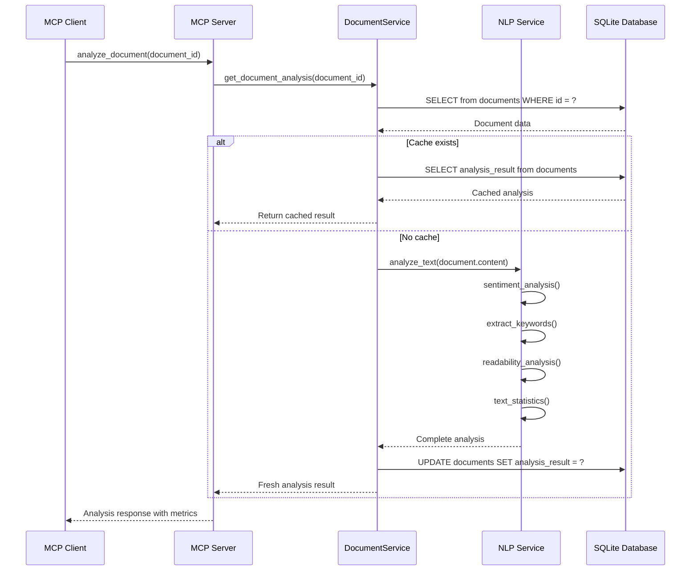
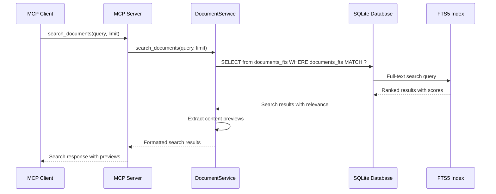
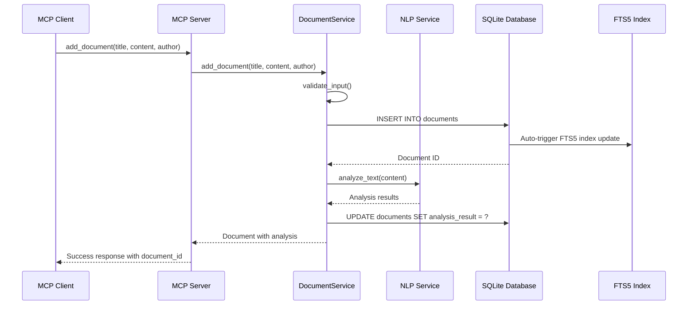

# Request Flow Sequences

## Document Analysis Flow

```mermaid
sequenceDiagram
    participant C as MCP Client
    participant MS as MCP Server
    participant DS as DocumentService
    participant NS as NLP Service
    participant DB as SQLite Database
    
    C->>MS: analyze_document(document_id)
    MS->>DS: get_document_analysis(document_id)
    DS->>DB: SELECT from documents WHERE id = ?
    DB-->>DS: Document data
    
    alt Cache exists
        DS->>DB: SELECT analysis_result from documents
        DB-->>DS: Cached analysis
        DS-->>MS: Return cached result
    else No cache
        DS->>NS: analyze_text(document.content)
        NS->>NS: sentiment_analysis()
        NS->>NS: extract_keywords()
        NS->>NS: readability_analysis()
        NS->>NS: text_statistics()
        NS-->>DS: Complete analysis
        DS->>DB: UPDATE documents SET analysis_result = ?
        DS-->>MS: Fresh analysis result
    end
    
    MS-->>C: Analysis response with metrics
```

## Document Search Flow

```mermaid
sequenceDiagram
    participant C as MCP Client
    participant MS as MCP Server
    participant DS as DocumentService
    participant DB as SQLite Database
    participant FTS as FTS5 Index
    
    C->>MS: search_documents(query, limit)
    MS->>DS: search_documents(query, limit)
    DS->>DB: SELECT from documents_fts WHERE documents_fts MATCH ?
    DB->>FTS: Full-text search query
    FTS-->>DB: Ranked results with scores
    DB-->>DS: Search results with relevance
    DS->>DS: Extract content previews
    DS-->>MS: Formatted search results
    MS-->>C: Search response with previews
```

## Document Addition Flow

```mermaid
sequenceDiagram
    participant C as MCP Client
    participant MS as MCP Server
    participant DS as DocumentService
    participant NS as NLP Service
    participant DB as SQLite Database
    participant FTS as FTS5 Index
    
    C->>MS: add_document(title, content, author)
    MS->>DS: add_document(title, content, author)
    DS->>DS: validate_input()
    DS->>DB: INSERT INTO documents
    DB->>FTS: Auto-trigger FTS5 index update
    DB-->>DS: Document ID
    DS->>NS: analyze_text(content)
    NS-->>DS: Analysis results
    DS->>DB: UPDATE documents SET analysis_result = ?
    DS-->>MS: Document with analysis
    MS-->>C: Success response with document_id
``` 