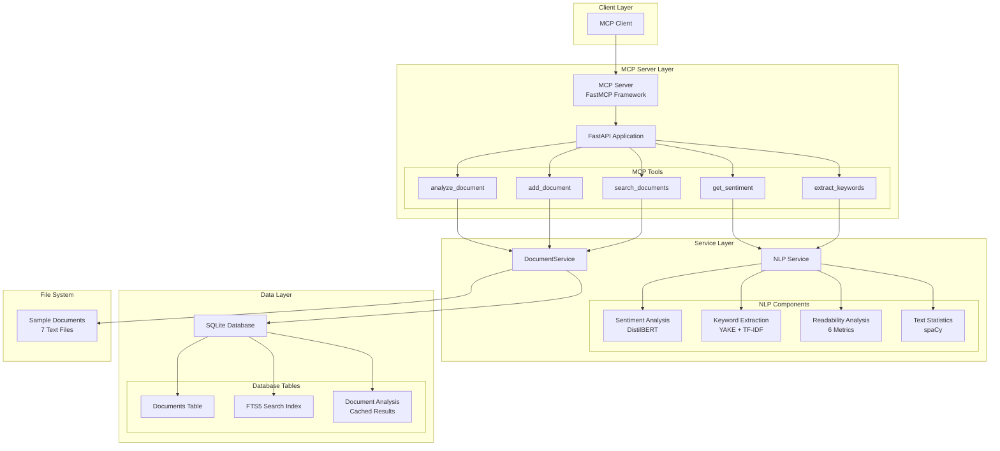

# System Architecture Diagram

```mermaid
graph TB
    subgraph "Client Layer"
        C[MCP Client]
    end
    
    subgraph "MCP Server Layer"
        MS[MCP Server<br/>FastMCP Framework]
        API[FastAPI Application]
        
        subgraph "MCP Tools"
            T1[analyze_document]
            T2[get_sentiment]
            T3[extract_keywords]
            T4[add_document]
            T5[search_documents]
        end
    end
    
    subgraph "Service Layer"
        DS[DocumentService]
        NS[NLP Service]
        
        subgraph "NLP Components"
            SA[Sentiment Analysis<br/>DistilBERT]
            KE[Keyword Extraction<br/>YAKE + TF-IDF]
            RA[Readability Analysis<br/>6 Metrics]
            TS[Text Statistics<br/>spaCy]
        end
    end
    
    subgraph "Data Layer"
        DB[SQLite Database]
        
        subgraph "Database Tables"
            DT[Documents Table]
            FTS[FTS5 Search Index]
            DA[Document Analysis<br/>Cached Results]
        end
    end
    
    subgraph "File System"
        SD[Sample Documents<br/>7 Text Files]
    end
    
    C --> MS
    MS --> API
    API --> T1
    API --> T2
    API --> T3
    API --> T4
    API --> T5
    
    T1 --> DS
    T2 --> NS
    T3 --> NS
    T4 --> DS
    T5 --> DS
    
    DS --> DB
    NS --> SA
    NS --> KE
    NS --> RA
    NS --> TS
    
    DB --> DT
    DB --> FTS
    DB --> DA
    
    DS --> SD
``` 