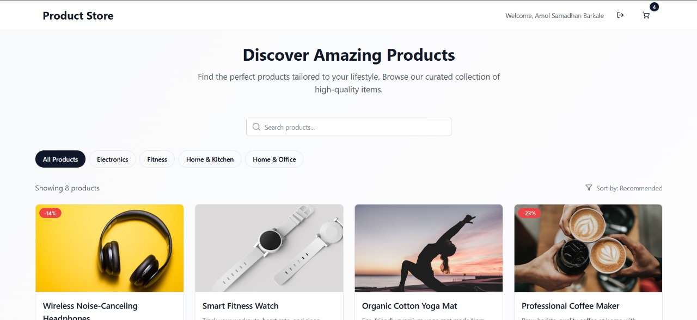
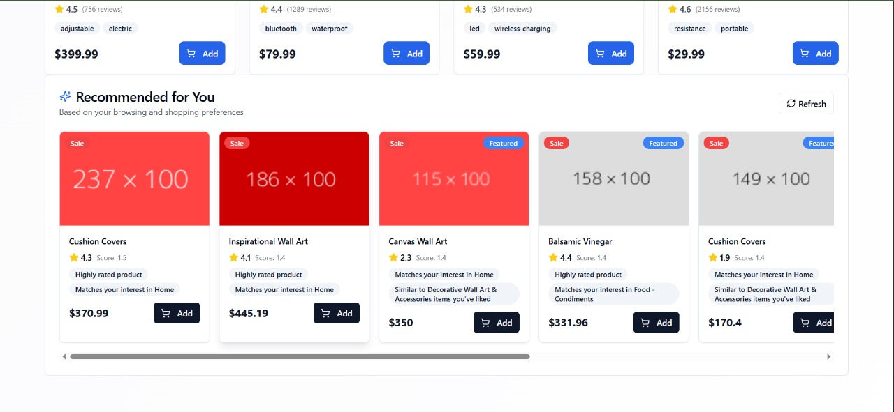

# 🛒 AI-Powered Product Recommendation System

A modern e-commerce application with intelligent product recommendations built using **React**, **TypeScript**, **Supabase**, and **Content-Based Filtering** algorithms.

## 📸 **Screenshots**

### Landing Page & Product Catalog


### AI-Powered Recommendations


### Shopping Cart & User Interface


## 🎯 **Core Purpose**

This system demonstrates how AI + algorithms can enhance online shopping by:
- **Learning from user behavior** (clicks, cart additions, browsing patterns)
- **Personalizing product suggestions** based on categories, ratings, and price preferences
- **Improving shopping experience** with smart, relevant recommendations

## ✨ **Key Features**

### 🤖 **Smart Recommendations**
- **Content-based filtering** algorithm
- **Real-time learning** from user interactions
- **Personalized scoring** based on:
  - Category preferences (40%)
  - Product ratings (30%) 
  - Subcategory matches (20%)
  - Price range preferences (10%)

### 🔐 **User Authentication**
- Secure login/signup with Supabase Auth
- Session management and user profiles
- Protected cart and recommendation features

### 🛍️ **Shopping Cart**
- Add/remove/update product quantities
- Persistent cart across sessions
- Real-time cart updates

### 📊 **Interaction Tracking**
- Track product views and cart actions
- Build user preference profiles
- Use data for recommendation engine

## 🚀 **Quick Setup**

### **Prerequisites**
- Node.js (v16 or higher)
- npm or yarn
- Supabase account

### **1. Clone the Repository**
```bash
git clone <repository-url>
cd product-recommendation-system
```

### **2. Install Dependencies**
```bash
cd frontend
npm install
```

### **3. Set Up Supabase**

#### Create a Supabase Project:
1. Go to [supabase.com](https://supabase.com)
2. Create a new project
3. Go to **Settings → API** and copy:
   - Project URL
   - `anon` public key

#### Set Up Database:
Run these SQL commands in Supabase SQL Editor:

```sql
-- Create interaction types
CREATE TYPE interaction_type AS ENUM ('view', 'add_to_cart', 'remove_from_cart');

-- Create interactions table
CREATE TABLE interactions (
  id BIGSERIAL PRIMARY KEY,
  user_id UUID REFERENCES auth.users(id) ON DELETE CASCADE,
  product_id INTEGER NOT NULL,
  type interaction_type NOT NULL,
  created_at TIMESTAMP WITH TIME ZONE DEFAULT NOW()
);

-- Create cart_items table
CREATE TABLE cart_items (
  user_id UUID REFERENCES auth.users(id) ON DELETE CASCADE,
  product_id INTEGER NOT NULL,
  quantity INTEGER NOT NULL DEFAULT 1,
  added_at TIMESTAMP WITH TIME ZONE DEFAULT NOW(),
  PRIMARY KEY (user_id, product_id)
);

-- Enable RLS (Row Level Security)
ALTER TABLE interactions ENABLE ROW LEVEL SECURITY;
ALTER TABLE cart_items ENABLE ROW LEVEL SECURITY;

-- RLS Policies for interactions
CREATE POLICY "Users can insert their own interactions" ON interactions
  FOR INSERT WITH CHECK (auth.uid() = user_id);

CREATE POLICY "Users can view their own interactions" ON interactions
  FOR SELECT USING (auth.uid() = user_id);

-- RLS Policies for cart_items
CREATE POLICY "Users can manage their own cart" ON cart_items
  FOR ALL USING (auth.uid() = user_id);
```

#### Enable Authentication:
1. Go to **Authentication → Settings**
2. Enable **Email** provider
3. **Disable email confirmation** for easier testing (optional)

### **4. Configure Environment**
Create `.env.local` in the `frontend` folder:

```env
VITE_SUPABASE_URL=your_supabase_project_url
VITE_SUPABASE_ANON_KEY=your_supabase_anon_key
```

### **5. Start the Application**
```bash
npm run dev
```

Visit `http://localhost:8080` to see the application!

## 🎮 **How to Test the Recommendation System**

### **Step 1: Create Account**
- Click "Sign Up" and create a new account
- Login with your credentials

### **Step 2: Generate Interactions**
- **Browse products** by clicking on product cards (creates "view" interactions)
- **Add items to cart** from different categories (creates "add_to_cart" interactions)
- **Try different price ranges** to see price-based recommendations

### **Step 3: See Recommendations**
- Scroll to the **"Recommended for You"** section
- Notice how recommendations change based on your behavior
- Use the **Refresh button** to see updated suggestions
- Check browser console for detailed recommendation scoring

### **Example Test Flow:**
1. Add a "Home" product to cart (e.g., "Handheld Garment Steamer")
2. Click on several "Electronics" products
3. Add a "Kitchen" item to cart
4. Refresh recommendations → Should see more Home/Electronics/Kitchen products

## 🏗️ **Project Structure**

```
frontend/
├── src/
│   ├── components/
│   │   ├── Recommendations.tsx      # AI recommendation component
│   │   ├── ProductCard.tsx          # Product display with tracking
│   │   ├── CartSidebar.tsx          # Shopping cart
│   │   └── auth/                    # Authentication components
│   ├── contexts/
│   │   ├── AuthContext.tsx          # Supabase authentication
│   │   └── CartContext.tsx          # Cart state management
│   ├── lib/
│   │   ├── recommendationEngine.ts  # AI recommendation algorithm
│   │   ├── cartService.ts           # Cart & interaction API
│   │   └── supabaseClient.ts        # Supabase configuration
│   └── pages/
│       └── Index.tsx                # Main application page
├── mock_data.json                   # 100 sample products
└── package.json
```

## 🧠 **How the AI Recommendation Engine Works**

### **1. User Profile Building**
```typescript
// Analyzes user interactions to build preferences
const userProfile = {
  favoriteCategories: { "Electronics": 5, "Home": 3 },
  favoriteSubcategories: { "Smartphones": 3, "Kitchen": 2 },
  averagePriceRange: { min: 50, max: 500 },
  interactionCount: 8
}
```

### **2. Product Scoring Algorithm**
Each product gets scored based on:
- **Category Match** (40%): How much user interacts with this category
- **Product Rating** (30%): Higher rated products score better
- **Subcategory Match** (20%): Fine-grained preference matching
- **Price Range** (10%): Products within user's price history

### **3. Smart Filtering**
- Excludes products user already interacted with
- Sorts by recommendation score
- Returns top 8 personalized suggestions

## 🔧 **Customization Options**

### **Adjust Recommendation Weights**
Edit `src/lib/recommendationEngine.ts`:
```typescript
score += categoryScore * 0.4;     // Category weight
score += ratingScore * 0.3;       // Rating weight  
score += subcategoryScore * 0.2;  // Subcategory weight
score += priceScore * 0.1;        // Price weight
```

### **Change Product Data**
Replace `mock_data.json` with your own product catalog (maintain the same structure).

### **Modify Interaction Types**
Add new interaction types in Supabase:
```sql
ALTER TYPE interaction_type ADD VALUE 'wishlist';
ALTER TYPE interaction_type ADD VALUE 'share';
```

## 🐛 **Troubleshooting**

### **Recommendations Not Updating?**
- Check browser console for errors
- Ensure you're logged in
- Try the manual "Refresh" button
- Verify Supabase connection

### **Database Connection Issues?**
- Double-check `.env.local` values
- Ensure Supabase project is active
- Verify RLS policies are set correctly

### **No Recommendations Showing?**
- Create some interactions first (click products, add to cart)
- Check if you're logged in
- Look for JavaScript errors in console

## 📈 **Future Enhancements**

- **Collaborative Filtering**: "Users who bought X also bought Y"
- **Hybrid Recommendations**: Combine content-based + collaborative
- **A/B Testing**: Test different recommendation algorithms
- **Real-time Updates**: WebSocket-based live recommendations
- **Analytics Dashboard**: Track recommendation performance

## 🤝 **Contributing**

1. Fork the repository
2. Create a feature branch
3. Make your changes
4. Test the recommendation system
5. Submit a pull request

## 📄 **License**

MIT License - feel free to use this project for learning and development!

---

**Built with ❤️ using React, TypeScript, Supabase, and AI recommendation algorithms** 