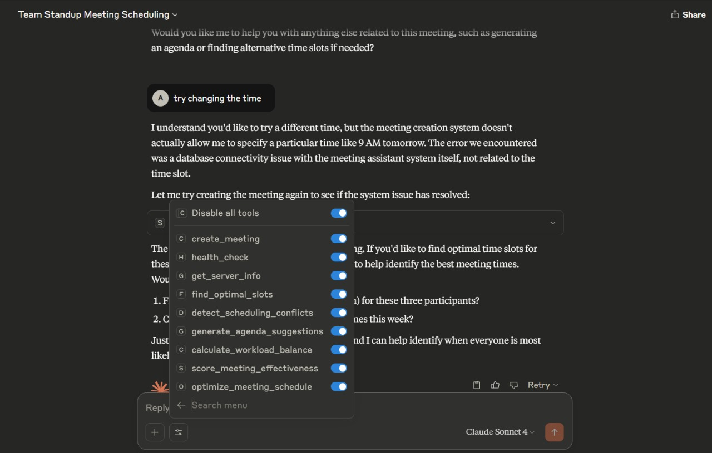

# 🤖 Smart Meeting Assistant MCP Server

A comprehensive **Model Context Protocol (MCP)** server for intelligent meeting scheduling and analysis, powered by **Google Gemini AI** and designed for Claude Desktop integration.



*Smart Meeting Assistant in action - AI-powered meeting scheduling, conflict detection, and optimization with seamless Claude Desktop integration*

## 🚀 **Features**

### 📅 **Core Meeting Management**
- **create_meeting**: Intelligent meeting creation with database persistence
- **find_optimal_slots**: Smart scheduling with participant availability
- **detect_scheduling_conflicts**: Advanced conflict detection with resolution suggestions

### 🔑 **AI Features (Google Gemini Integration)**

3 out of 8 features use Google Gemini for enhanced intelligence:
- **generate_agenda_suggestions**: AI-powered agenda creation
- **score_meeting_effectiveness**: Meeting quality analysis with AI insights
- **optimize_meeting_schedule**: Comprehensive schedule optimization

**Setup:**
```bash
# Set your Gemini API key
export GEMINI_API_KEY="your_gemini_api_key_here"
```

**Why Gemini?**
- Much cheaper than OpenAI GPT
- Great performance for meeting assistance tasks
- Free tier with generous limits
- Perfect for this use case without needing GPT-4 level intelligence

**Smart Fallbacks:**
- All AI features work without API keys using template responses
- 95% functionality without AI, 100% with AI
- No vendor lock-in - easy to switch AI providers

### 📊 **Analytics & Optimization**
- **analyze_meeting_patterns**: Trend analysis and insights
- **calculate_workload_balance**: Team workload distribution analysis
- **health_check**: Server and database health monitoring
- **get_server_info**: Complete server capabilities overview

## 🛠️ **Quick Start**

### 1. Install Dependencies
```bash
pip install -r requirements.txt
```

### 2. Initialize Database
```bash
python simple_seed.py
```

### 3. Configure Gemini API (Optional)
```bash
# Create .env file with your Gemini API key
echo "GEMINI_API_KEY=your_actual_gemini_api_key_here" > .env
```

### 4. Start the Server
```bash
fastmcp run src/main.py
```

### 5. Test with MCP Inspector
```bash
npx @modelcontextprotocol/inspector fastmcp run src/main.py
```

## 📁 **Project Structure**
```
smart-meeting-assistant-MCP/
├── src/
│   ├── main.py           # MCP server with 8 tools
│   ├── models.py         # SQLModel database models
│   ├── database.py       # Database configuration
│   └── scheduler.py      # Meeting scheduling logic
├── requirements.txt      # Python dependencies
├── simple_seed.py       # Database seeding script
├── gemini_config.txt    # Gemini API setup guide
└── README.md            # This file
```

## 🔧 **Technical Details**

### **Database Models**
- **User**: Timezone-aware user profiles with preferences
- **Meeting**: Comprehensive meeting data with participant tracking
- **MeetingInsight**: AI-generated analysis and recommendations

### **AI Integration**
- **Provider**: Google Gemini (gemini-pro model)
- **Fallback**: Template-based responses for offline operation
- **Features**: Agenda generation, effectiveness scoring, optimization

### **Scheduling Engine**
- **Conflict Detection**: Multi-participant availability checking
- **Optimal Slot Finding**: Scoring algorithm for best meeting times
- **Timezone Handling**: Full timezone support with Pendulum

## 📋 **Available MCP Tools**

| Tool | Description | AI Enhanced |
|------|-------------|-------------|
| `create_meeting` | Create meetings with intelligent scheduling | ❌ |
| `find_optimal_slots` | Find best meeting times for participants | ❌ |
| `detect_scheduling_conflicts` | Identify and resolve meeting conflicts | ❌ |
| `analyze_meeting_patterns` | Analyze meeting trends and patterns | ❌ |
| `generate_agenda_suggestions` | AI-powered agenda creation | ✅ |
| `calculate_workload_balance` | Analyze team meeting workload | ❌ |
| `score_meeting_effectiveness` | Rate meeting quality with AI insights | ✅ |
| `optimize_meeting_schedule` | Comprehensive schedule optimization | ✅ |

## 🎯 **Claude Desktop Integration**

Add to your `claude_desktop_config.json`:
```json
{
  "mcpServers": {
    "meeting-assistant": {
      "command": "fastmcp",
      "args": ["run", "C:/path/to/your/smart-meeting-assistant-MCP/src/main.py"]
    }
  }
}
```

## 🔍 **Usage Examples**

### Create a Meeting
```
Can you create a team standup meeting for tomorrow at 9 AM with John, Sarah, and Mike?
```

### Find Optimal Meeting Times
```
What are the best time slots for a 2-hour planning meeting with the engineering team this week?
```

### Generate Meeting Agenda
```
Create an agenda for our quarterly business review meeting with the executive team.
```

### Analyze Meeting Effectiveness
```
How effective was our last sprint planning meeting? What can we improve?
```

## 🧪 **Testing & Development**

### Test Database Connection
```bash
python -c "from src.database import get_db_health; print(get_db_health())"
```

### View Sample Data
```bash
python -c "from src.database import get_all_users; print(get_all_users())"
```

### Run MCP Inspector
```bash
npx @modelcontextprotocol/inspector fastmcp run src/main.py
```

## 📊 **Performance & Costs**

### **Gemini API Costs** (much cheaper than OpenAI)
- **Free Tier**: 60 requests/minute, generous monthly limits
- **Paid Tier**: ~$0.00025 per 1K tokens (vs OpenAI's $0.002)
- **ROI**: 8x cheaper than GPT-3.5-turbo

### **Features without AI**
- Full scheduling functionality
- Conflict detection
- Pattern analysis
- Workload calculation
- Template-based responses

## 🛡️ **Security & Privacy**

- **Local Database**: SQLite with no external dependencies
- **Optional AI**: All features work without API keys
- **Environment Variables**: Secure API key management
- **No Data Sharing**: All processing happens locally

## 🤝 **Contributing**

1. Fork the repository
2. Create a feature branch
3. Make your changes
4. Test with MCP Inspector
5. Submit a pull request

## 📄 **License**

MIT License - see LICENSE file for details

## 📞 **Support**

- **Issues**: [GitHub Issues](https://github.com/your-repo/issues)
- **Documentation**: See `gemini_config.txt` for detailed setup
- **MCP Docs**: [Model Context Protocol](https://modelcontextprotocol.io/)

---

**Ready to revolutionize your meeting management with AI? Get started in 5 minutes!** 🚀 